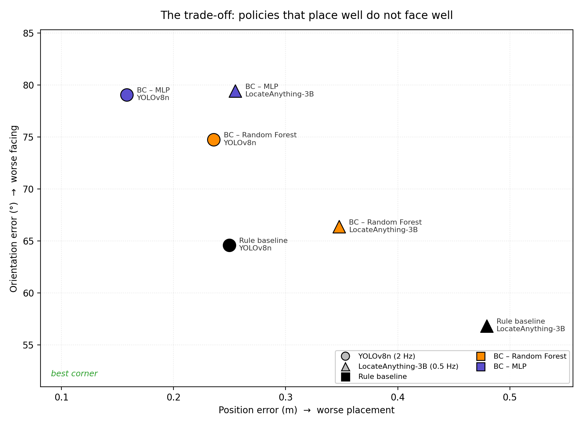
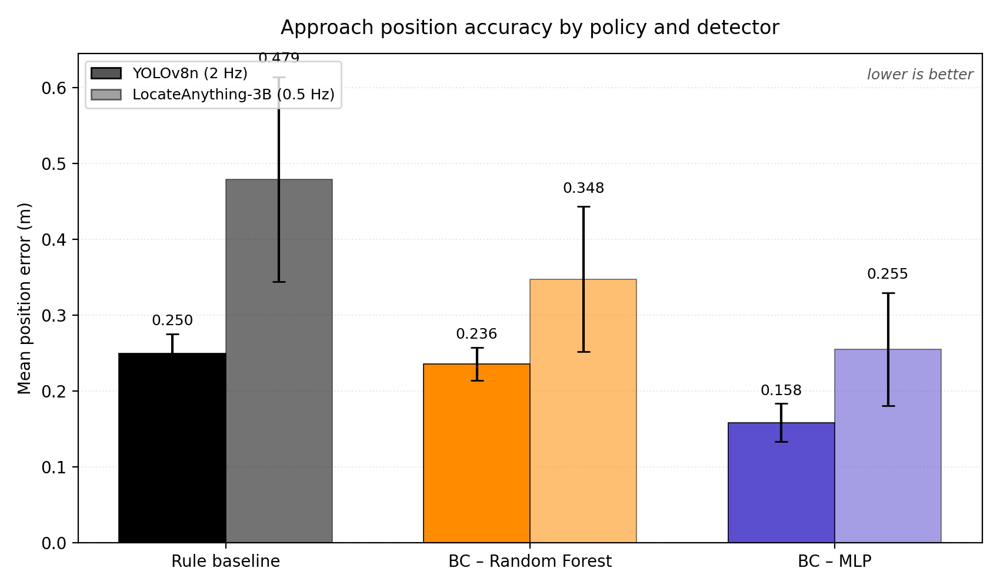
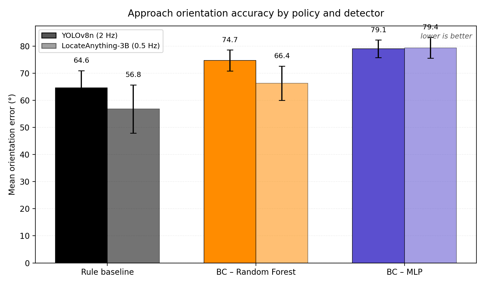
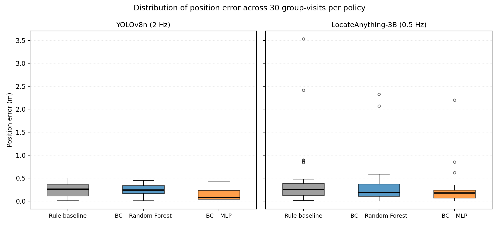
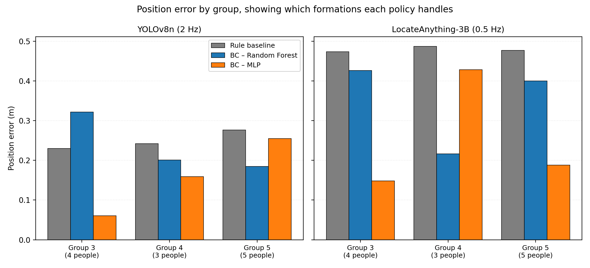

# Learning Socially Appropriate Group-Approach Behaviour for a TIAGo Robot from Non-Expert Human Demonstrations

MSc Robotics dissertation project, University of Lincoln (CMP9140M).

A TIAGo service robot learns **where to stand** when approaching a small group
of people in conversation, by copying what non-expert humans did when they
drove the robot themselves. The learned behaviour is compared against a
hand-coded geometric rule, under two different perception systems, across 60
simulated trials.

---

## The problem, in one paragraph

Imagine a robot waiter in a restaurant. Three people are standing talking. The
robot needs to come over — but *where exactly should it stop?* Walk into the
middle of the circle and it is rude and startling. Stop six feet back and
nobody notices it. Approach from behind someone and they have to turn round.

Humans solve this without thinking. There is a right place to stand: just
outside the group's shared space, in the gap between two people, facing
inward. This project asks whether a robot can **learn that from watching
people**, rather than being told the rule.

<!-- ============================================================
     ADD A PICTURE HERE  (optional but very effective)
     A photo or Gazebo screenshot of TIAGo standing beside a group.
     Save it as: docs/images/hero_robot_beside_group.png
     Then delete this comment block and uncomment the line below.
     ============================================================ -->
<!--  -->

---

## Headline result

The learned model places the robot within **8.5 cm** (median) of a socially
ideal standing position — beating the hand-coded rule by 67%. But it does
**not** learn which way to face as reliably as simply pointing at the group.

| | Position error (median) | Orientation error (mean) |
|---|---|---|
| **BC – MLP** (learned) | **0.085 m** | 79.1° |
| BC – Random Forest (learned) | 0.241 m | 74.7° |
| Rule baseline (hand-coded) | 0.261 m | **64.6°** |

Read that table twice — **the two columns rank in opposite orders.** That
inversion is the project's central finding, and it points directly at a hybrid
design: use the learned model for *position*, and a geometric constraint for
*orientation*.



---

## Background: three ideas you need

**Proxemics** (Hall, 1966). People keep predictable distances from each other.
The "personal zone" runs roughly 0.45–1.2 m. A robot that violates it feels
threatening; one that ignores it entirely feels aloof.

**F-formations** (Kendon, 1990). When people talk in a group they arrange
themselves so their attention converges on a shared empty space in the middle.
That empty middle is the **O-space**. The ring where the people themselves
stand is the **P-space**. A newcomer joins by stepping into a *gap* in the
P-space ring — never by walking into the O-space.

```
        person
          |
   person-+-person        the empty middle is the O-SPACE
          |               the ring of people is the P-SPACE
       [ GAP ]  <-------- a newcomer joins HERE
```

**Behavioural Cloning.** The simplest form of learning from demonstration:
record what a human did, then train a model to predict the same action from
the same situation. No reward function, no trial and error — just supervised
learning on human examples.

<!-- ============================================================
     ADD A DIAGRAM HERE  (recommended — this concept is central)
     A simple drawing of an F-formation: people in a ring, the
     O-space shaded in the middle, arrows marking the gaps.
     Save it as: docs/images/f_formation_diagram.png
     ============================================================ -->
<!--  -->

---

## How the system works

```
    RECORDED HUMAN DEMONSTRATIONS               LIVE ROBOT
    (PLUS-HRI, 24 sessions)                     (Gazebo simulation)
              |                                       |
              v                                       v
    +---------------------+                +----------------------+
    | video (.mp4)        |                | head camera          |
    | sensors (.bag)      |                | RGB + depth          |
    | commands (.csv)     |                +----------+-----------+
    +----------+----------+                           |
               |                                      v
               v                              YOLOv8n  or  LocateAnything-3B
        YOLOv8n person detection                       |
               |                                       v
               v                              cluster into groups
        cluster into groups                            |
               |                                       v
               v                              7 features
        7 features + the human's                       |
        actual stop pose as the label                  v
               |                              TRAINED MODEL predicts a pose
               v                                       |
        TRAIN Random Forest / MLP  ------------------->+
                                                       v
                                              Nav2 drives there, robot
                                              dwells 30 s, then leaves
```

**The seven features** the model sees at each moment — no images, just numbers:

| Feature | Meaning |
|---|---|
| `lidar_min_range` | distance to the nearest obstacle |
| `lidar_mean_range` | average distance all round — how open the space is |
| `linear_x_prev` | how fast the robot was just driving |
| `angular_z_prev` | how fast it was just turning |
| `num_people` | how many people are visible |
| `group_bearing_rad` | which direction the group is in |
| `group_scale_norm` | how big they appear — a proxy for how close |

**What it predicts:** `target_dx, target_dy, target_dyaw` — where to stop,
relative to where the robot is now.

---

## Repository layout

```
Research_Project/
├── src/                              ROS 2 packages
│   ├── tiago_group_approach/         the robot's brain
│   │   ├── group_perception_node.py    camera -> people -> groups
│   │   ├── bc_policy_node.py           learned model -> Nav2 goal
│   │   ├── group_approach_baseline_node.py   the hand-coded rule
│   │   ├── mission_node.py             patrol route, yields on approach
│   │   ├── metrics_recorder_node.py    scores every trial
│   │   └── gt_localisation_node.py     ground-truth map->odom in simulation
│   ├── tiago_social_worlds/          the restaurant, people, ground truth
│   └── tiago_head_control/           head aiming (a debugging aid)
│
├── scripts/                          ~57 pipeline and analysis scripts
├── dataset/processed/                derived tables, models, results
│   ├── models/                         trained .joblib files
│   └── results_FINAL_20260824/         the 60 reported trials + figures
├── docs/                             written analyses
└── tests/                            unit tests
```

Every script carries a plain-language header explaining what it is, why it
exists and how to run it. Open any file and read the top.

---

## Installation

Built and tested on **Ubuntu 22.04 / ROS 2 Humble / Python 3.10.12**.

```bash
git clone https://github.com/saaruba/Research_Project.git
cd Research_Project
pip install --user -r requirements.txt
colcon build --packages-select tiago_group_approach tiago_social_worlds
source install/setup.bash
```

**Versions are pinned deliberately.** `numpy 2.2.6 / scipy 1.15.3 /
scikit-learn 1.7.2 / pandas 2.3.3` is a combination that works together; the
apt system `scipy 1.8.0` does **not** work with numpy 2 and produces a
confusing `_ARRAY_API not found` failure. See the comments in
`requirements.txt`.

**LocateAnything-3B needs its own environment** — it pins numpy 1.25, which is
incompatible with everything above. It therefore runs as a separate HTTP
service in its own virtualenv:

```bash
bash scripts/setup_locateanything.sh      # creates la3b_env, downloads weights
```

**The raw dataset is not in this repository** — 24 PLUS-HRI sessions, about
70 GB, git-ignored. The derived tables and trained models are included, so
everything downstream of extraction can be reproduced without it.

---

## Running it

### 1. Check your setup

```bash
bash scripts/check_sim_setup.sh
```

### 2. Start the simulation

```bash
bash scripts/run_everything.sh restaurant_testing rule --no-pipeline
```

Gazebo, TIAGo, the map, localisation and Nav2 come up together. Takes two to
three minutes. Leave it running.

<!-- ============================================================
     ADD A SCREENSHOT HERE  (strongly recommended)
     Gazebo showing the restaurant with people and TIAGo,
     ideally alongside RViz with the detection boxes visible.
     Save it as: docs/images/simulation_running.png
     ============================================================ -->
<!--  -->

### 3. Something not working?

```bash
bash scripts/preflight_check.sh
```

Walks the whole chain in dependency order and names the **first** broken link.
Fix that one and re-run — later failures are usually consequences of it.

### 4. Run one trial

```bash
MIN_GROUP_SIZE=2 DWELL_TIME_S=30 \
bash scripts/run_pipeline.sh restaurant_testing mlp_ft
```

Policies: `rule`, `bc_ft` (Random Forest), `mlp_ft` (MLP).

### 5. Run the full experiment

```bash
RUN=$PWD/dataset/processed/results_$(date +%Y%m%d)
mkdir -p "$RUN/yolo" "$RUN/locateanything"

MIN_GROUP_SIZE=2 RESULTS_DIR="$RUN/yolo" DETECTOR=yolo \
DWELL_TIME_S=30 MAX_APPROACH_TIME=60 \
bash scripts/run_trials.sh restaurant_testing 10 "rule bc_ft mlp_ft"

MIN_GROUP_SIZE=2 RESULTS_DIR="$RUN/locateanything" DETECTOR=locateanything \
ONESHOT=periodic RETRIGGER_PERIOD_S=2 DWELL_TIME_S=30 MAX_APPROACH_TIME=60 \
bash scripts/run_trials.sh restaurant_testing 10 "rule bc_ft mlp_ft"
```

Roughly five hours unattended for all 60 trials.

### 6. Analyse

```bash
python3 scripts/summarise_sim_results.py --results-dir "$RUN/yolo"
python3 scripts/plot_results.py --run "$RUN"
```

---

## Results

60 trials — 3 policies × 10 repeats × 2 detectors. Each trial visits 3
conversational groups, giving **180 group-visits**.

### Position accuracy

How close the robot came to an ideal standing slot, computed from F-formation
geometry (on the bisector of each formation gap, 0.6 m outside the O-space).



Both learned policies beat the rule, under **both** detectors — the same
ordering twice over, independently.

### Orientation accuracy



And here the ranking inverts. The rule's facing is hard-coded — it turns to the
group centre by construction, so it cannot be badly wrong. The learned models
*predict* orientation, which was always their weakest output.

### The spread behind the averages



This one corrects a misleading impression. On **means**, LocateAnything-3B
looks much worse than YOLOv8n. On **medians** the typical trial is comparable.
The difference is a handful of trials 2–3.5 m off target. The honest statement
is not "the slower detector is less accurate" but "the slower detector
occasionally fails badly".

### Per group



No policy wins everywhere. The MLP is outstanding on the tight four-person
square (0.061 m) and weaker on the loose five-person ring. The rule is
strikingly *consistent* across all three — mediocre, but predictable, because
it applies the same geometry regardless of formation shape.

### Robustness to perception rate

Dropping detection from 2 Hz to 0.5 Hz, the rule baseline began walking
**between** members of a group in 6 of 10 trials, against 0 of 10 at full rate
(Fisher exact, **p = 0.011**). The learned policies did not degrade at all.

---

## Objectives and outcomes

Five numeric targets were set **in the proposal, before any results existed**.
All five were measured. Three were met.

| # | Objective | Target | Measured | Met |
|---|---|---|---|---|
| 1 | Literature review | 18–20 sources | 23 | Yes |
| 2 | Person-detection recall | ≥ 80% | **99.7%** | Yes |
| 3 | O-space centre accuracy | ≥ 70% within tolerance | 36.7% | No |
| 4a | Approach position error | < 0.4 m | 0.365 m | Yes |
| 4b | Approach orientation error | < 20° | 25.8° | No |

**Why Objective 3 missed.** The pipeline estimates the O-space centre as the
centroid of person bounding boxes. Against 30 hand-labelled frames it lands
0.61 person-widths away at the median, against a 0.5 bar. People walking
through frame drag the centroid off the actual conversation.

**Why Objective 4b missed.** Orientation is genuinely harder to learn than
position from this data — and the live results show why it matters: the rule's
hard-coded facing beats the learned one (64.6° vs 79.1°). That is the evidence
behind the hybrid recommendation.

---

## Limitations

**No metric ground truth in the recordings.** PLUS-HRI gives person positions
as pixel boxes from an uncalibrated monocular camera. Distances in metres are
not recoverable, so several quantities are proxies — `lidar_min_range` stands
in for group distance, and Objective 3's tolerance is expressed in person-widths
rather than metres. This is stated wherever it applies rather than hidden.

**The corpus is smaller than it looks.** 70,555 training rows sounds
substantial, but they come from only **462 approach events**, and only 182 of
those involve more than a metre of walking. Rows sampled at 30 Hz are
near-duplicates. Measured directly: increasing independent *events* improves
accuracy; increasing *rows per event* makes it slightly worse.

**Simulation, not real people.** Every live result is from Gazebo. No human
participants were involved at any stage, which is also why no ethics approval
was required.

**n = 10 per condition.** Adequate for the effect sizes reported; not for fine
distinctions. Every rate is quoted with its denominator.

---

## Reproducing the analysis

The trained models and derived tables are in the repository, so the results can
be regenerated without the 70 GB of raw video:

```bash
python3 scripts/evaluate_approach_pose.py                     # offline model comparison
python3 scripts/summarise_sim_results.py --results-dir dataset/processed/results_FINAL_20260824/yolo
python3 scripts/plot_results.py --run dataset/processed/results_FINAL_20260824
python3 scripts/validate_ospace_estimate.py                   # Objective 3
python3 tests/test_periodic_perception.py                     # unit test
```

Random seeds are fixed throughout (`random_state=42`), so these reproduce
exactly rather than approximately.

---

## Further reading in this repository

| Document | Contents |
|---|---|
| `docs/APPROACH_ACCURACY_RESULTS.md` | Full results, five tables, interpretation, limitations |
| `docs/V2_RETRAINING_STUDY.md` | Four attempts to improve the models, all measured, all rejected on evidence |
| `docs/RESULTS_TABLES.md` | Every table with provenance and guidance on what may be claimed |
| `docs/PROJECT_RECORD_POST_REPORT1.md` | Engineering record, including 22 documented faults and their fixes |
| `docs/Section_3_6_Evaluation_Metrics.md` | Every metric defined, with the reasoning behind each threshold |
| `docs/LAB_PC_SETUP.md` | Setting the project up on a second machine |

---

## Acknowledgements and licence

Built on the **PLUS-HRI** dataset, **PAL Robotics'** TIAGo packages,
**Ultralytics YOLOv8**, and **NVIDIA LocateAnything-3B** (research and
non-commercial use only). See `LICENSE`.

## Repositry Link 

https://github.com/saaruba/Research_Project.git
